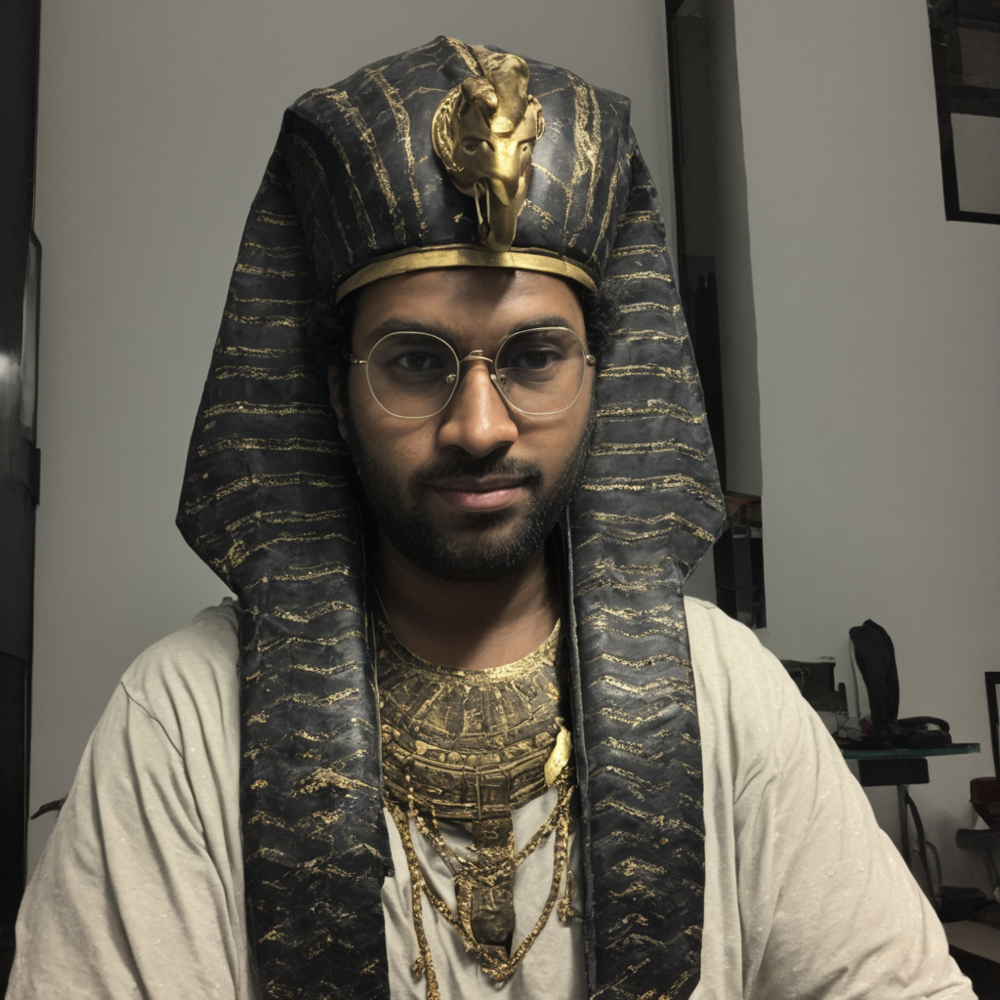
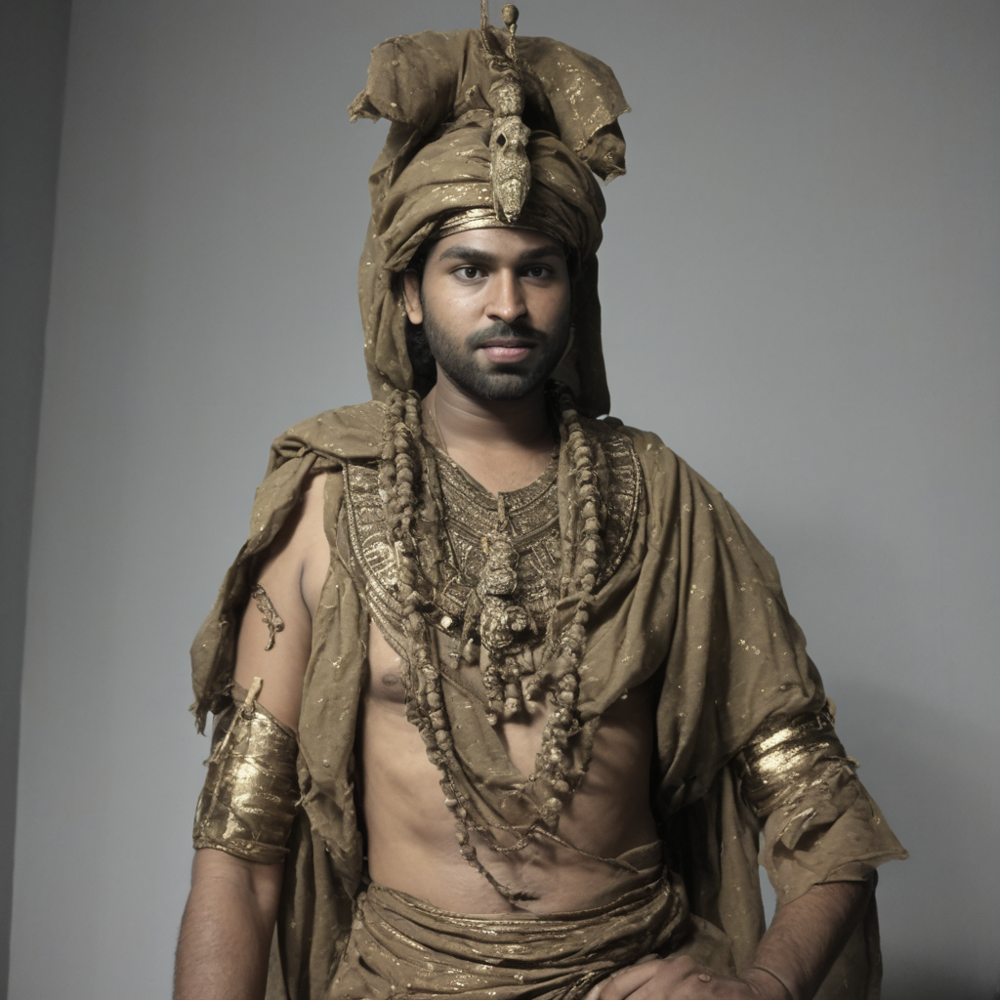
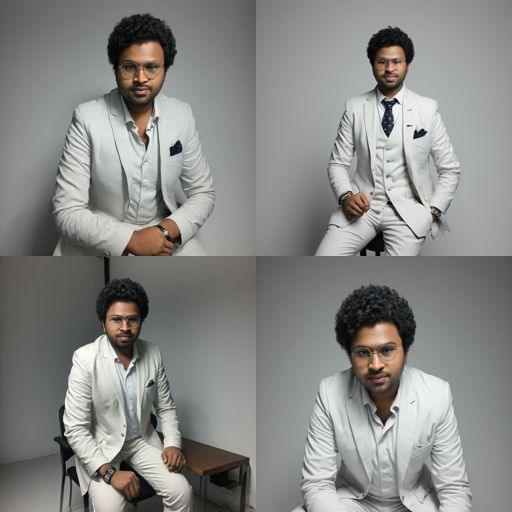
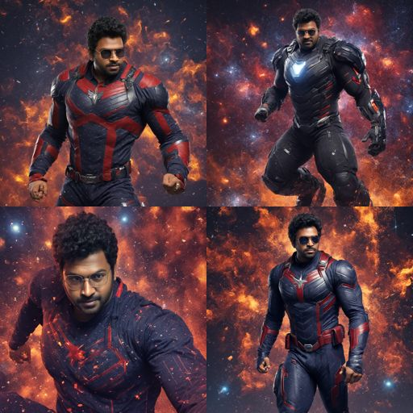
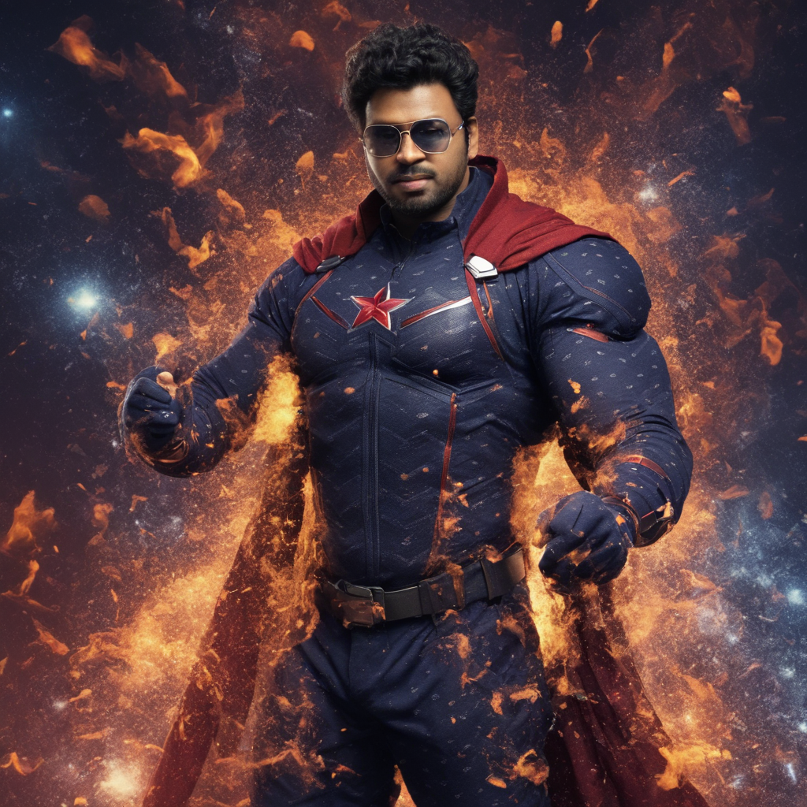
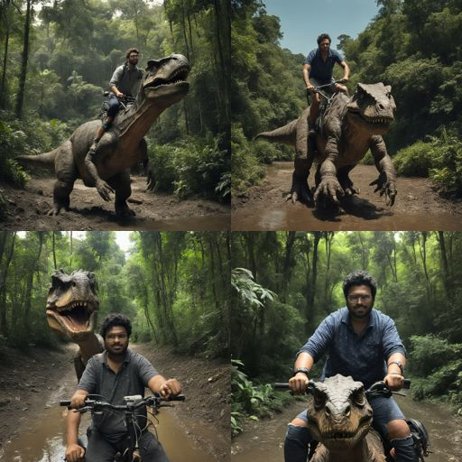
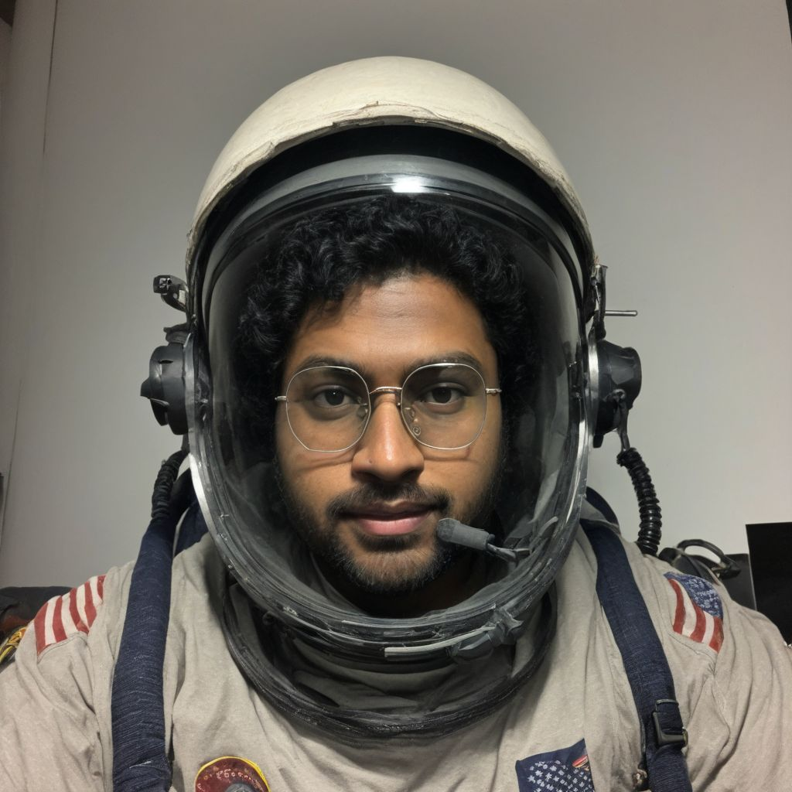
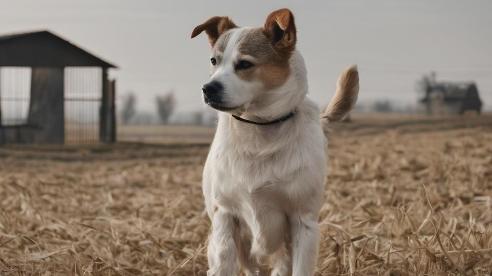
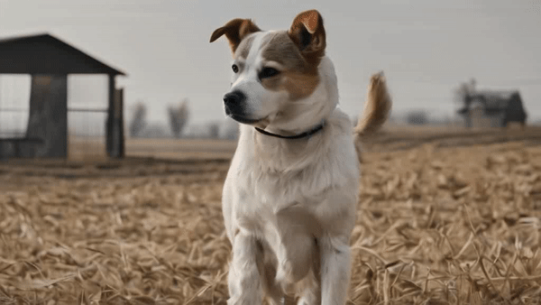

# SDXL - LoRA - DreamBooth

## 🧪 Development

```
black .
isort .
```

```
pip install -r requirements.txt
```

Tested with

```
torch==2.2.0.dev20231201+cu121
transformers==4.35.2
https://github.com/huggingface/diffusers.git@6bf1ca2c799f3f973251854ea3c379a26f216f36
typer==0.9.0
accelerate==0.24.1
rich==12.5.1
compel==2.0.2
```

## CLI

```
❯ python main.py dreambooth --help                                                 
 Usage: main.py dreambooth [OPTIONS]                                                                                                                                                          
                                                                                                                                                                                              
 Fine Tune Stable Diffusion with LoRA and DreamBooth                                                                                                                                          
                                                                                                                                                                                              
╭─ Options ──────────────────────────────────────────────────────────────────────────────────────────────────────────────────────────────────────────────────────────────────────────────────╮
│ *  --input-images-dir                                     TEXT            Path to folder containing training data [default: None] [required]                                               │
│ *  --instance-prompt                                      TEXT            The prompt with identifier specifying the instance, e.g. 'a photo of a ohwx man', 'a photo of a TOK man wearing  │
│                                                                           casual clothes, smiling'                                                                                         │
│                                                                           [default: None]                                                                                                  │
│                                                                           [required]                                                                                                       │
│    --base-model                                           TEXT            Base Model to train Dreambooth on [default: stabilityai/stable-diffusion-xl-base-1.0]                            │
│    --pretrained-vae                                       TEXT            VAE model with better numerical stability [default: madebyollin/sdxl-vae-fp16-fix]                               │
│    --resolution                                           INTEGER         The resolution for input images, all the images will be resized to this [default: 1024]                          │
│    --train-batch-size                                     INTEGER         Batch Size (per device) for training [default: 1]                                                                │
│    --max-train-steps                                      INTEGER         Total number of training steps to run for, more your images, more should be this value [default: 500]            │
│    --gradient-accumulation-steps                          INTEGER         Number of update steps to accumulate before performing a backward pass [default: 1]                              │
│    --learning-rate                                        FLOAT           Initial learning rate for training, after warmup period [default: 0.0001]                                        │
│    --use-8bit-adam                  --no-use-8bit-adam                    Whether or not to use 8-bit Adam from bitsandbytes. Ignored if optimizer is not set to AdamW                     │
│                                                                           [default: no-use-8bit-adam]                                                                                      │
│    --use-tf32                       --no-use-tf32                         Whether or not to allow TF32 on Ampere GPUs. Can be used to speed up training. [default: no-use-tf32]            │
│    --mixed-precision                                      [no|fp16|bf16]  Whether to use mixed precision. Choose between fp16 and bf16 (bfloat16). Bf16 requires PyTorch >=1.10.and an     │
│                                                                           Nvidia Ampere GPU.  Default to the value of accelerate config of the current system or the flag passed with the  │
│                                                                           `accelerate.launch` command. Use this argument to override the accelerate config.                                │
│                                                                           [default: MixedPrecisionType.no]                                                                                 │
│    --lora-rank                                            INTEGER         The dimension of the LoRA update matrices [default: 4]                                                           │
│    --output-dir                                           TEXT            The output directory to store the logs, model predictions, checkpoints and final lora model weights              │
│                                                                           [default: lora-dreambooth-model]                                                                                 │
│    --help                                                                 Show this message and exit.                                                                                      │
╰────────────────────────────────────────────────────────────────────────────────────────────────────────────────────────────────────────────────────────────────────────────────────────────╯

```

## 🔥 Fine Tune

```
accelerate launch main.py dreambooth --input-images-dir ./data/tresa-truck --instance-prompt "a photo of a ohwx truck" --resolution 512 --train-batch-size 1 --max-train-steps 1000 --mixed-precision fp16 --output-dir ./output/tresa-truck
```

```
07/12/2023 23:36:01 INFO     07/12/2023 23:36:01 - INFO - training.dreambooth - unet params = 2567463684                                                                         logging.py:60
07/12/2023 23:36:06 INFO     07/12/2023 23:36:06 - INFO - training.dreambooth - training lora parameters = 5806080                                                               logging.py:60
                    INFO     07/12/2023 23:36:06 - INFO - training.dreambooth - using torch AdamW                                                                                logging.py:60
                    INFO     07/12/2023 23:36:06 - INFO - training.dreambooth - 🚧 computing time ids                                                                            logging.py:60
                    INFO     07/12/2023 23:36:06 - INFO - training.dreambooth - precomputing text embeddings                                                                     logging.py:60
07/12/2023 23:36:07 INFO     07/12/2023 23:36:07 - INFO - training.dreambooth - 🏃 🏃 🏃 Training Config 🏃 🏃 🏃                                                                logging.py:60
                    INFO     07/12/2023 23:36:07 - INFO - training.dreambooth -   Num examples = 8                                                                               logging.py:60
                    INFO     07/12/2023 23:36:07 - INFO - training.dreambooth -   Num batches each epoch = 8                                                                     logging.py:60
                    INFO     07/12/2023 23:36:07 - INFO - training.dreambooth -   Instantaneous batch size per device = 1                                                        logging.py:60
                    INFO     07/12/2023 23:36:07 - INFO - training.dreambooth -   Total train batch size (w. parallel, distributed & accumulation) = 1                           logging.py:60
                    INFO     07/12/2023 23:36:07 - INFO - training.dreambooth -   Gradient Accumulation steps = 1                                                                logging.py:60
                    INFO     07/12/2023 23:36:07 - INFO - training.dreambooth -   Total optimization steps = 1000 
                    INFO     07/12/2023 23:36:07 - INFO - training.dreambooth - 🧪 start training... 
07/12/2023 23:47:19 INFO     07/12/2023 23:47:19 - INFO - training.dreambooth - ✅ training done!                                                                                logging.py:60
                    INFO     07/12/2023 23:47:19 - INFO - training.dreambooth - 🍉 saved lora weights in ./output/tresa-truck-2                                                  logging.py:60
                    INFO     07/12/2023 23:47:19 - INFO - training.dreambooth - 🎉 🎉 🎉 ALL DONE 🎉 🎉 🎉                                                                       logging.py:60
Steps 100% ━━━━━━━━━━━━━━━━━━━━━━━━━━━━━━━━━━━━━━━━━━━━━━━━━━━━━━━━━━━━━━━━━━━━━━━━━━━━━━━━━━━━━━━━━━━━━━━━━━━━━━━━━━━━━━━━━━━━━━━━━━━━━━━━━━━━━━━ 1,000/1,000  [ 0:11:12 < 0:00:00 , 1 it/s ]
```

## 🍺 Infer

```
python main.py infer --prompt "a photo of a ohwx truck in a jungle" --lora-weights ./output/tresa-truck --output-dir output/infer-truck
```

## 😁 Outputs
















## Stable Diffusion Video Output

SDXL Generated Image



SD Video


